
<h1 align="center">便民自行车管理系统的开发与实现+vue</h1>

## 简介
便民自行车管理系统：角色分为管理员和用户；包括车辆租赁、订单管理、信息录入、个人资料管理、充值和轮播图管理等功能模块。    --计算机毕业设计源码；毕设源码；java毕业设计源码

## 联系方式

<h3 align="center">获取完整代码与数据库文件 + 微信：deepguan QQ: 86050149 QQ群: 783742310</h3>

<h3 align="center">可帮忙远程部署 包运行成功！提供远程部署、修改代码、设计文档指导、代码讲解等服务！</h3>

## 功能介绍（完整见运行截图）
管理员：负责车辆、用户和订单的全面管理，提供车辆信息录入、编辑、删除等操作，支持订单管理、用户信息维护及系统基础数据管理，包括导航栏配置、轮播图设置等功能，确保系统的高效运行。

用户：可以登录系统进行个人信息管理、租用车辆及充值操作，提供账户余额查询、订单管理、个人资料编辑及车辆收藏等功能，同时支持通过筛选条件快速查找所需车辆并完成租赁。

游客：无需注册即可浏览车辆列表及其详细信息，通过筛选功能查看车辆类型、价格及状态，支持访问系统的首页和基本功能模块，了解系统提供的便民服务。

租赁人员：专注于车辆租用和订单管理，支持查询租赁时长、支付金额及订单状态，同时可以通过支付模块完成订单费用的结算及账户充值操作，提升用户体验与管理效率。

## 运行截图
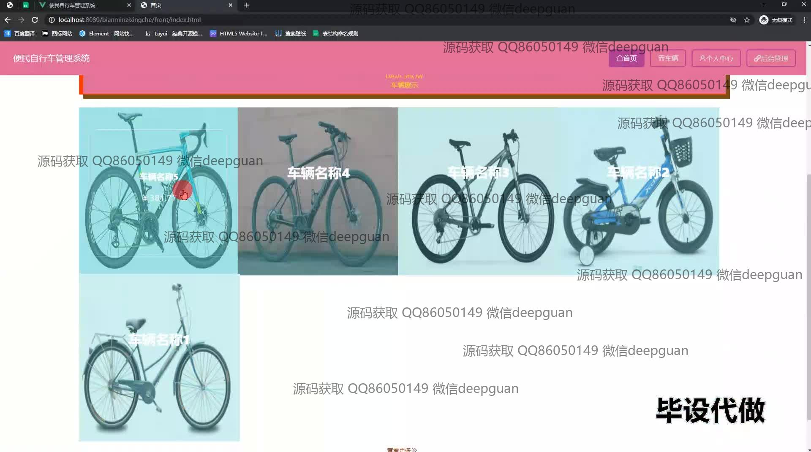
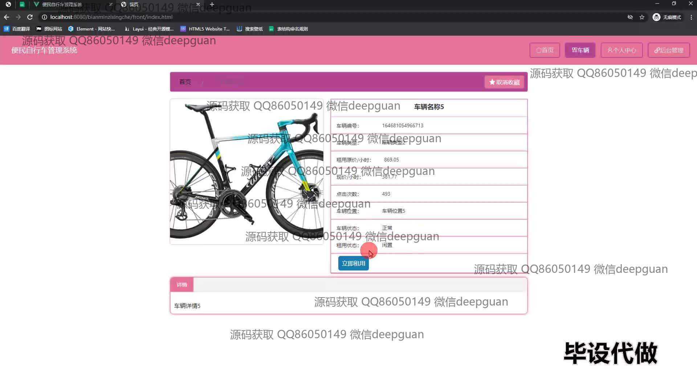
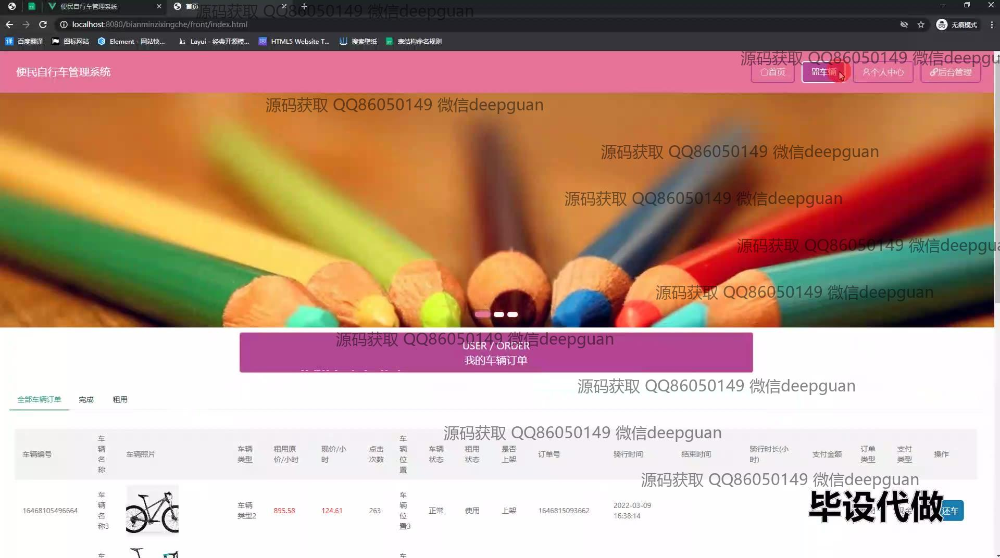
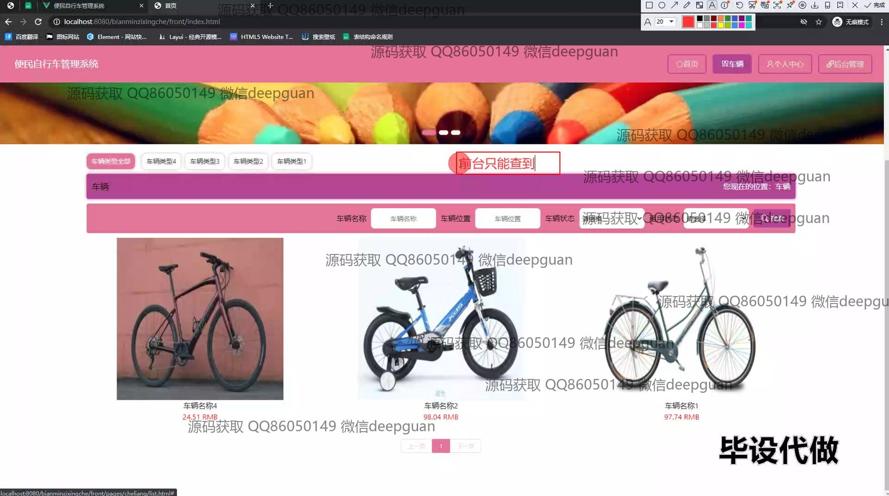
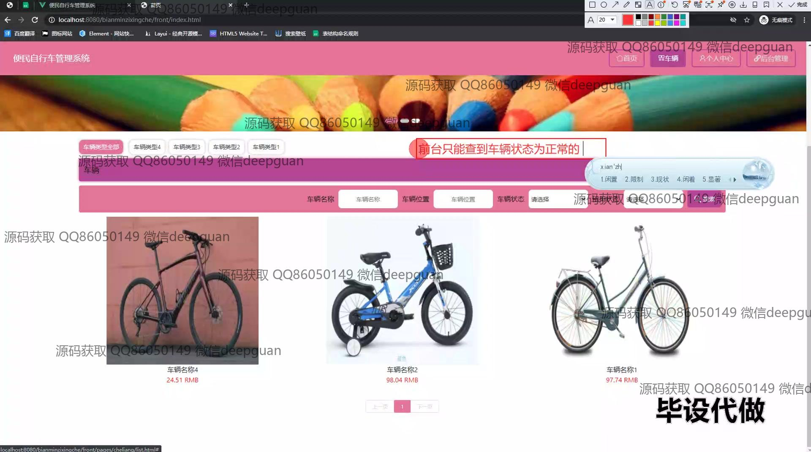
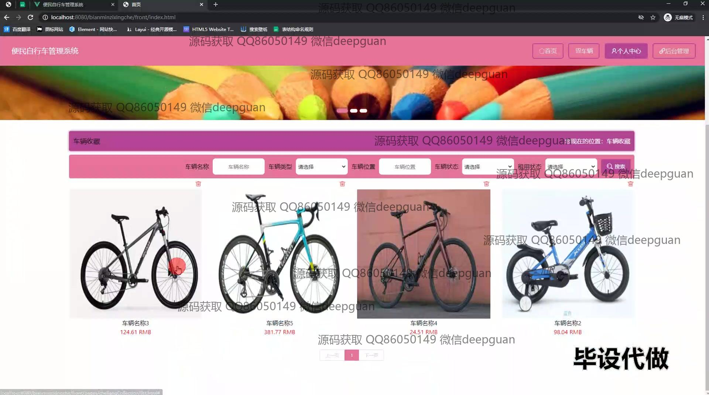
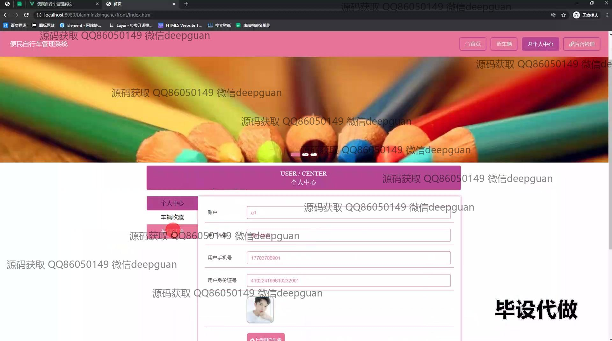
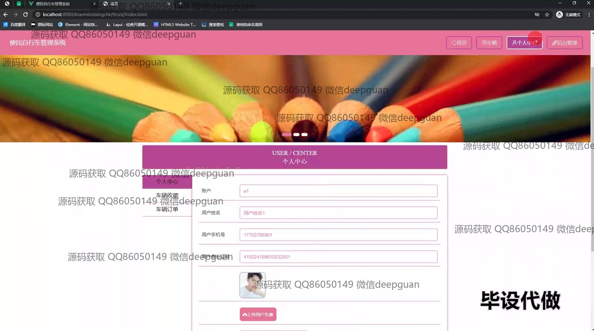
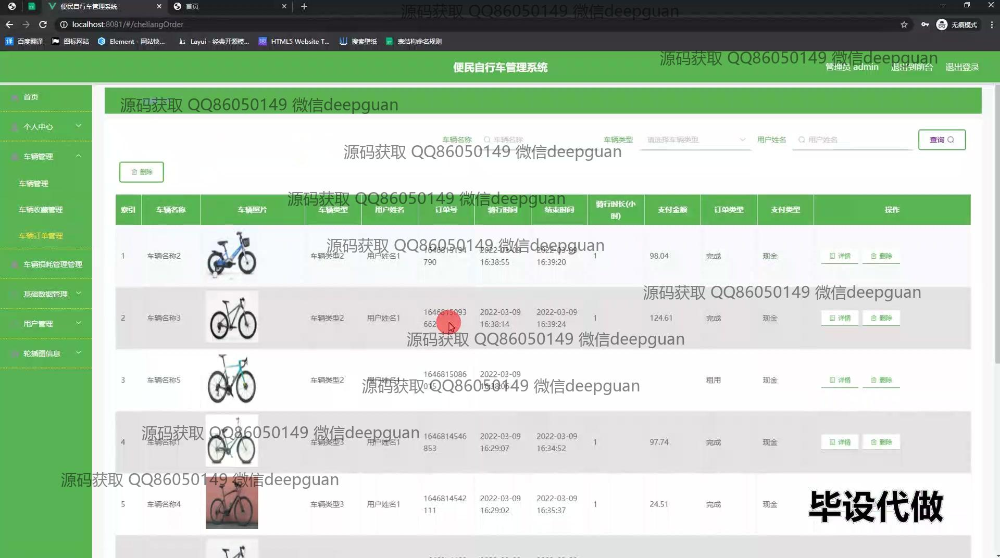
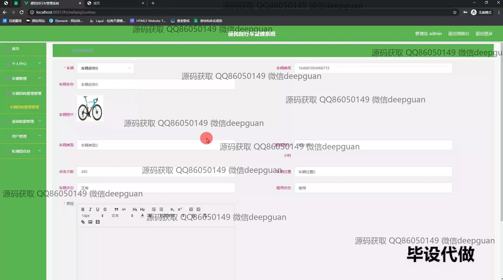
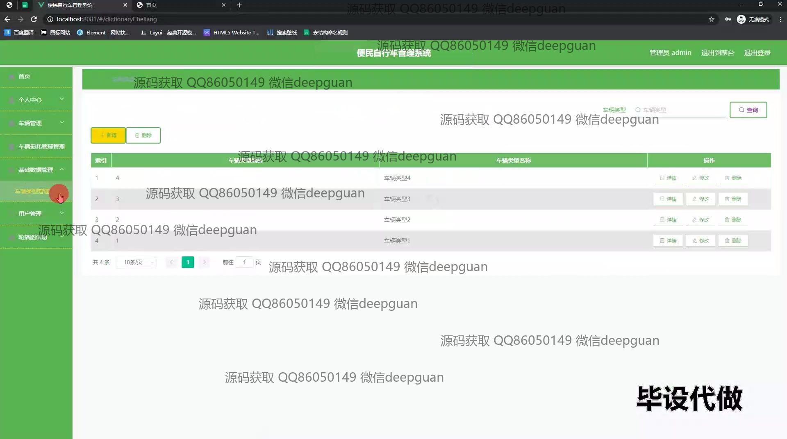
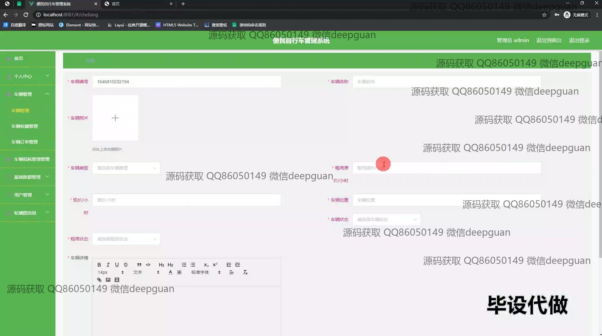
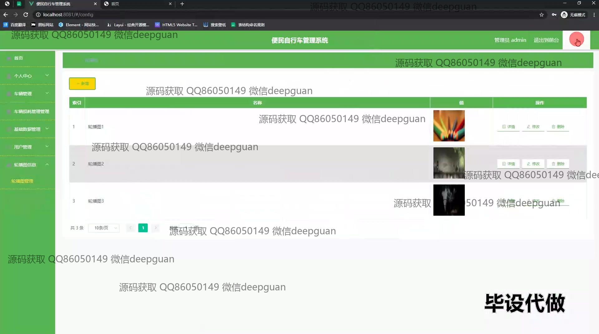
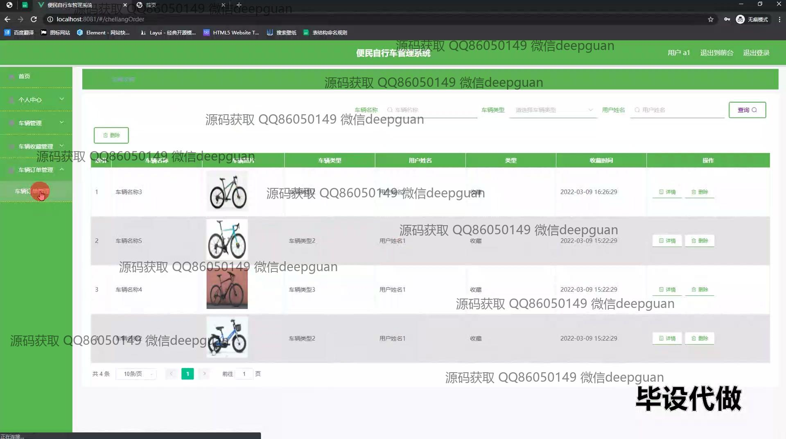
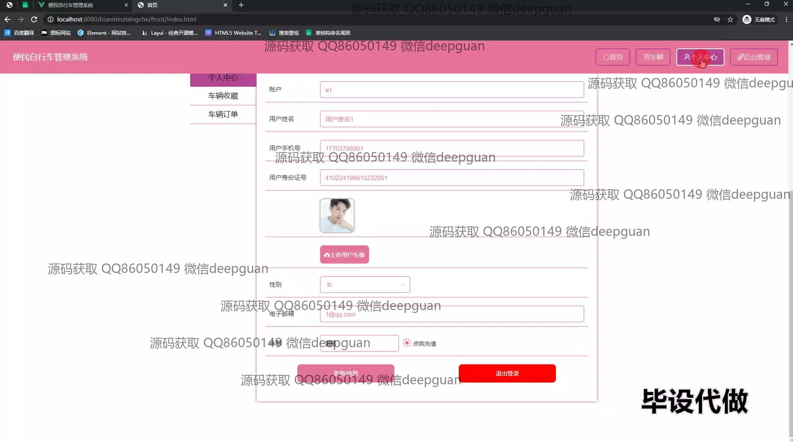
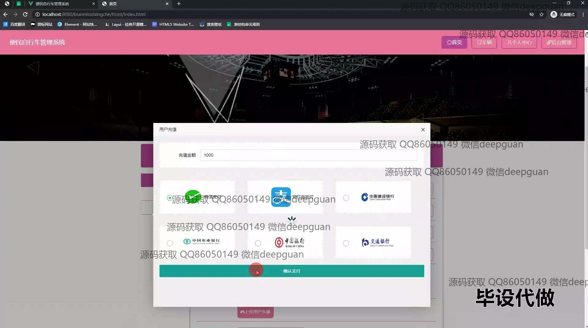
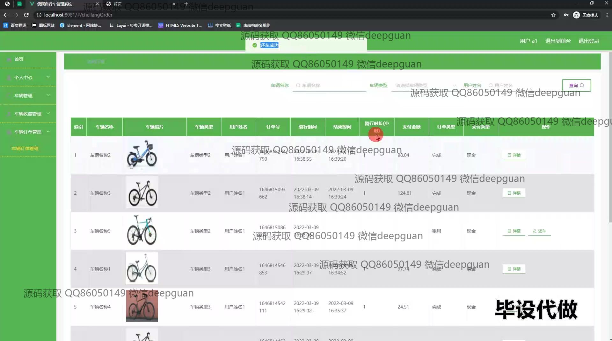

本代码来源于网络,仅供学习参考使用!

